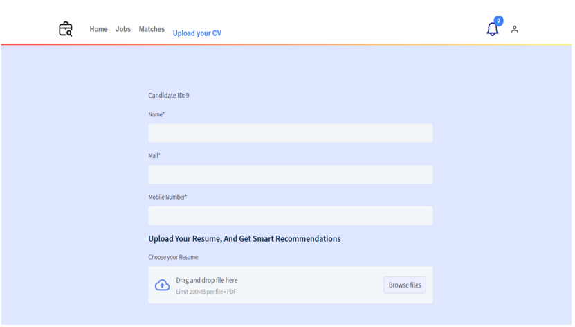

### **Jobify - Recruitment Platform README**

---

## **🚀 Project Overview**

Welcome to **Jobify**, a platform designed to streamline the recruitment process by automatically matching candidates' skills with job descriptions. Using matching algorithms, it simplifies the job application process for candidates and provides recruiters with more effective candidate recommendations. The goal is to create an efficient, user-friendly recruitment solution for both job seekers and employers.

---

## **🎯 Features & Highlights**

### **For Recruiters**
- **Job Post Management**: Add, modify, and delete job offers with specific requirements.
- **Candidate Recommendations**: Receive recommendations for candidates with transferable skills.
- **Job Application Notifications**: Get notified when candidates match job requirements.
- **Resume Feedback**: Receive insights on the candidates’ resumes and their matching scores.

### **For Candidates**
- **Job Matching**: View a list of job offers ranked by relevance.
- **Resume Submission**: Submit resumes for AI analysis and get matched with relevant job offers.
- **Application Status**: Receive feedback on resume status to track progress in the recruitment process.

---

## **🧑‍💻 Tech Stack**

Jobify uses modern technologies to ensure a seamless and scalable user experience:

- **Frontend**: Angular, TypeScript, HTML5, CSS3, Bootstrap
- **Backend**: Django (Python), REST APIs
- **Database**: MySQL
- **Authentication**: JSON Web Tokens (JWT)
- **Deployment**: Nginx, Gunicorn, SSL for secure connections

---

## **💡 How to Get Started**

Follow these simple steps to set up **Jobify** locally:

### Step 1: Clone the Repository

```bash
git clone https://github.com/taysir17/Jobify.git
cd jobify
```

### Step 2: Install Frontend Dependencies

```bash
cd frontend
npm install
```

### Step 3: Install Backend Dependencies

```bash
cd backend
pip install -r requirements.txt
```

### Step 4: Configure the Database
- Set up a MySQL database and configure the database settings in `backend/settings.py`.

### Step 5: Migrate Database

```bash
cd backend
python manage.py migrate
```

### Step 6: Run the Application

#### Frontend:
```bash
cd frontend
ng serve --open
```

#### Backend:
```bash
cd backend
python manage.py runserver
```

You're all set! Access the platform at `http://localhost:4200` for the frontend and `http://localhost:8000` for the backend API.

---

## **🔍 Key Screenshots & Demos**

Here's a preview of the app with screenshots for key interfaces:

### **Recruiter Interface**
- Manage job postings: add, modify, or delete.


- Notifications for candidate applications.


### **Candidate Interface**
- View job matches ranked by relevance.


- Submit resume for AI analysis.


### 🎥 Video Demo

Watch the full demo video [here](https://www.dropbox.com/scl/fi/iflbpdznupui19fz3mrcb/Demo-Jobify-Made-with-Clipchamp_1733850143846.mp4?rlkey=600z2uw4pqjpq4uulbtdr61ng&dl=0).

---

## **🔑 API Documentation with Swagger**

Swagger was integrated into the backend to provide an interactive and easy-to-navigate API documentation interface:

- **API Endpoints**: All backend endpoints are documented automatically using **drf-yasg**.
- **Interactive UI**: Test API calls directly from the Swagger UI, located at `/swagger/` in the app.
- **Benefits**: With Swagger, developers and external users can understand and test the backend API seamlessly.

---

## **📈 Contribution Guidelines**

We welcome contributions to **Jobify**! Here’s how you can contribute:
1. Fork the repository on GitHub.
2. Create a new branch: `git checkout -b feature-xyz`.
3. Make your changes and commit them: `git commit -am 'Add feature XYZ'`.
4. Push your branch: `git push origin feature-xyz`.
5. Create a pull request for review.

We follow the **GitFlow** workflow for new features and bug fixes.

---

## **📜 License**

This project is licensed under the MIT License – see the [LICENSE](LICENSE) file for details.

---

## **🔒 Security**

Jobify integrates **JWT Authentication** for secure user login, ensuring that both recruiters and candidates can access only their designated features.

---

### **🎨 UI/UX Design**

Jobify boasts a clean, intuitive interface with smooth transitions between job listings, applications, and candidate notifications. The platform is designed to be user-friendly, ensuring ease of use for non-technical users.

---

### **🚀 Ready to Get Started?**

Clone the repository, follow the setup instructions, and begin using **Jobify** today! Streamline your recruitment process with intelligent job matching and a seamless user experience.
